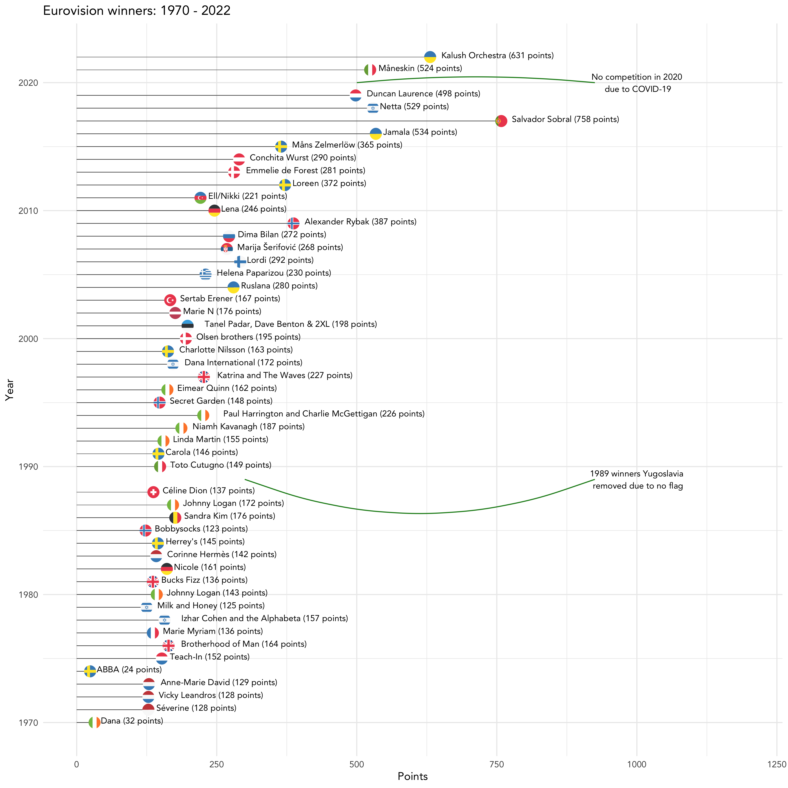
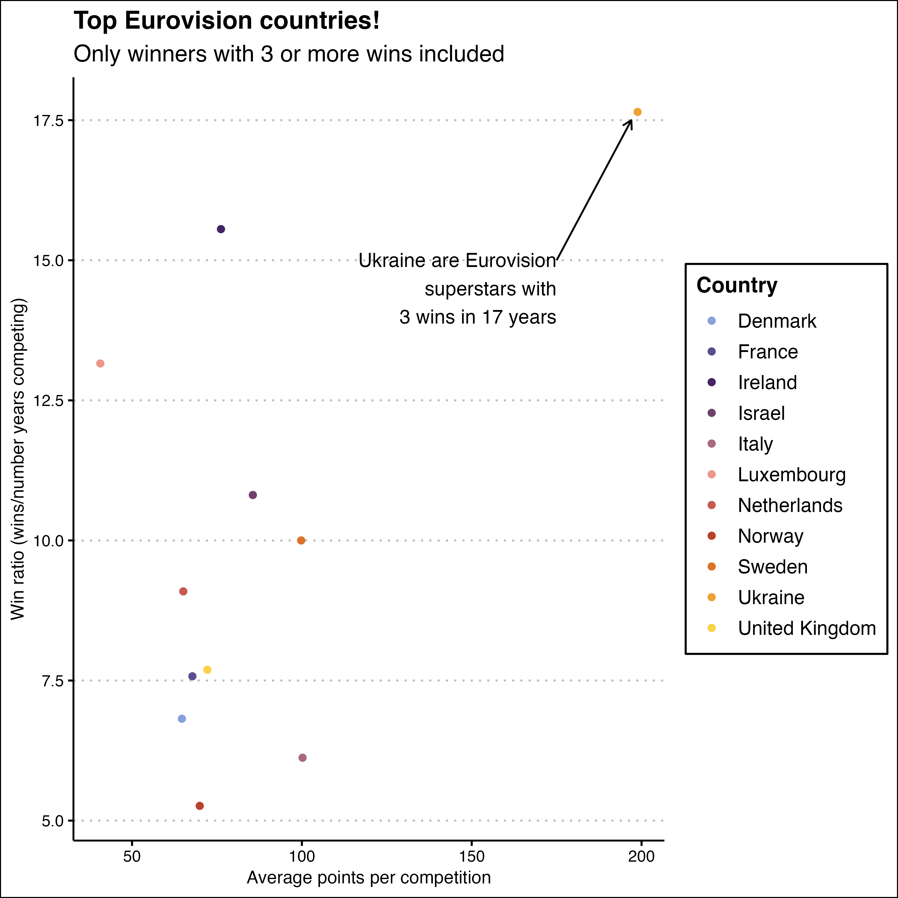

# demo-repo
This repository is a demonstration of how to store your visualisations on GitHub.

The script that made these visualisations is [eurovision.R](eurovision.R).

This visualisation looks at the Eurovision winners by year, from 1970 to this year (2022).

This visualisation looks at which country has the best Eurovision win ratio!

